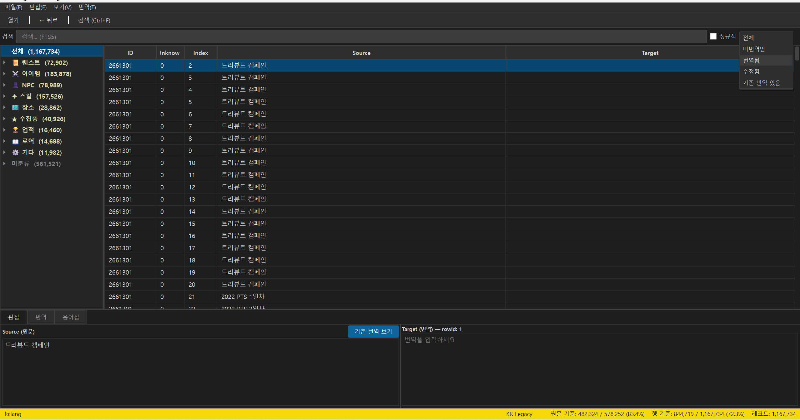
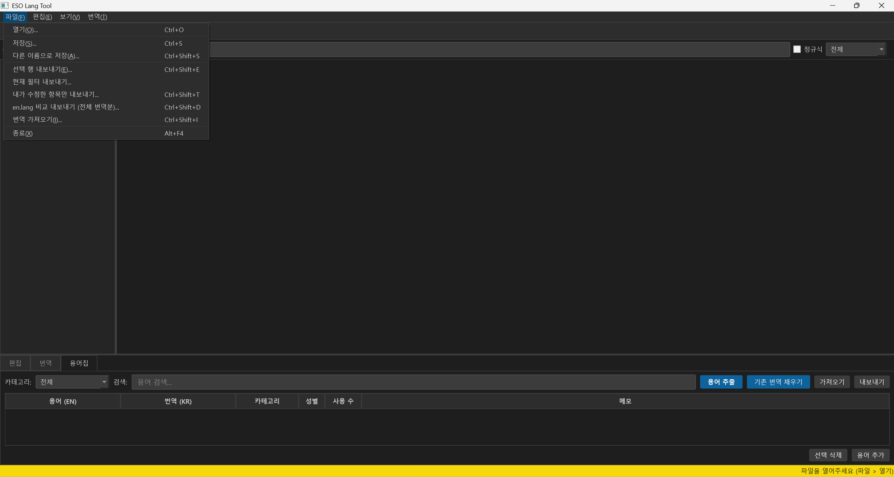
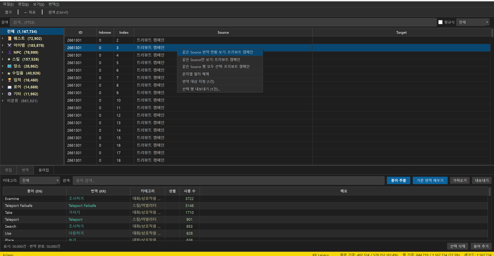
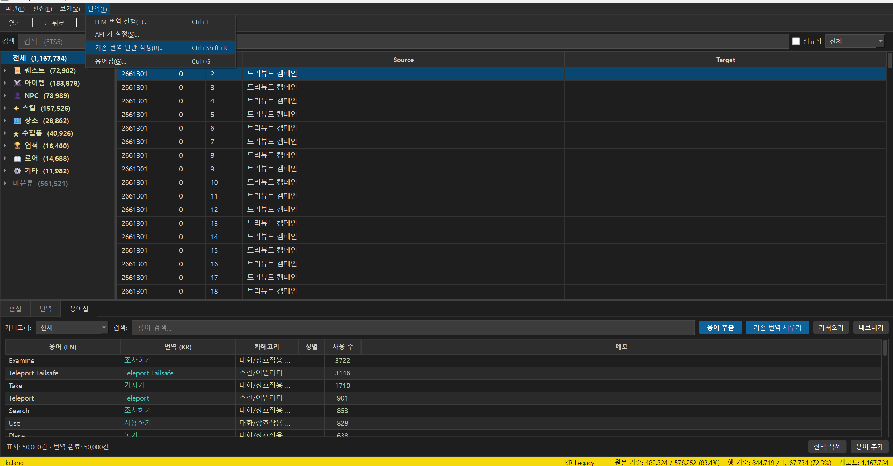

# ESO Lang Tool

Elder Scrolls Online `.lang` 바이너리 파일 한글화 편집 도구.



## 주요 기능

- **117만 레코드** 고속 로딩/검색/편집 (SQLite + FTS5 전문 검색)
- **14개 카테고리** 자동 분류 (대화, 퀘스트, 아이템, NPC, 스킬 등 99.4% 커버리지)
- **AI 자동 번역** (Google Gemini / Anthropic Claude / OpenAI GPT)
- **용어집** 자동 추출 및 번역 일관성 유지
- **기존 한글 패치** 번역 재활용 (kr.lang 참조 자동 연결)
- **일괄 편집** (다중 선택, 찾기/치환, Undo/Redo 200단계)
- **JSON 내보내기/가져오기** (협업 워크플로우 지원)
- **수정 이력 추적** (세션 간 유지)

## 다운로드

[Releases](../../releases) 페이지에서 최신 버전을 다운로드하세요.

> `ESO.Lang.Tool.zip` 다운로드 → 압축 해제 → `ESO Lang Tool.exe` 실행

별도 설치 과정 없이 바로 실행 가능합니다.

## 화면 구성

| 영역 | 설명 |
|------|------|
| 왼쪽 트리 | 카테고리별 분류 (대화, 퀘스트, NPC, 아이템 등) |
| 오른쪽 테이블 | 레코드 목록 (ID, Source, Target) |
| 하단 패널 | 편집 / AI 번역 / 용어집 탭 |
| 상태바 | 파일명, 코덱, 번역 진행률 |

## 사용법

### 기본 워크플로우

1. `kr.lang` 파일 열기 (`Ctrl+O`)
2. 카테고리/검색/필터로 번역 대상 탐색
3. 하단 편집 패널에서 번역 입력
4. 저장 (`Ctrl+S`)

### 파일 열기



| 파일 | 설명 |
|------|------|
| `kr.lang` | 한글 패치 파일 (번역 작업 대상) |
| `en.lang` | 영어 원본 (참고용 자동 연결) |

코덱은 자동 감지됨 (KR Legacy / Identity).

### 검색 및 필터

- `Ctrl+F` — 실시간 검색 (FTS5)
- 정규식 모드 지원
- 상태 필터: 전체 / 미번역 / 번역됨 / 수정됨 / 기존 번역 있음
- 카테고리 + 검색 + 상태 필터 동시 적용 가능

### 우클릭 메뉴



- 참고 Source 번역 보기
- 같은 Source에 일괄 적용
- AI 번역 대상 지정
- 선택 행 내보내기

### 용어집



- 자동 추출 (NPC, 아이템, 스킬 등 고유명사)
- 기존 번역 자동 채우기
- AI 번역 시 프롬프트에 자동 포함
- JSON 내보내기/가져오기

### AI 번역

1. 행 선택 → 우클릭 → 번역 대상 지정
2. 번역 탭에서 프로바이더/모델 선택
3. 번역 시작

품질 자동 검증: 빈 번역, 영어 그대로, 한국어 비율, 길이 비율, 플레이스홀더 누락 체크.

## 단축키

| 키 | 기능 |
|---|---|
| `Ctrl+O` | 파일 열기 |
| `Ctrl+S` | 저장 |
| `Ctrl+F` | 검색 |
| `Ctrl+H` | 찾기/치환 |
| `Ctrl+Z/Y` | Undo/Redo |
| `F3` | 다음 미번역 이동 |
| `Ctrl+G` | 용어집 |
| `Ctrl+T` | 번역 탭 |
| `Ctrl+Shift+E` | 선택 행 내보내기 |
| `Ctrl+Shift+I` | 번역 가져오기 |
| `Ctrl+Shift+R` | 기존 번역 일괄 적용 |

## 빌드

```bash
pip install pyinstaller PyQt6 google-genai
pyinstaller eso_lang_tool.spec --noconfirm
```

빌드 결과: `dist/ESO Lang Tool/`

## 개발 환경에서 실행

```bash
pip install -r requirements.txt
python main.py
```

## 테스트

```bash
python -m pytest tests/ -q
```

## 라이선스

이 프로젝트는 개인 사용 목적의 한글화 도구입니다.
